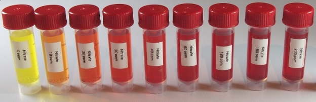

API nitrate test kit
========================

Reagents & Equipment
----------------------------

* Colorimeter
* Cuvettes
* 5 mL sample bottles or other capped tubes
* API nitrate test kit
* (Optional) Distilled water for sample dilutions

Colorimeter set-up
------------------------

* Wavelength: 528 nm. Green led (colorimeter RGB board) 
* Nitrate standard data: download a data file or prepare your own nitrate standard data
* Before measuring blank the colorimeter against water or a distilled water sample developed with API reagent as described below

Method
---------

* Fill an empty sample bottle to the 5 mL line with your water sample.
* Add 10 drops of reagent from Bottle # 1 to the sample, cap and invert several times to mix
* Vigorously shake Bottle # 2 for 30-60 secs
* Add 10 drops of reagent from Bottle # 2 
* Cap the bottle and shake thoroughly to mix. 
* Wait at least 5 mins for the color to develop.
* Pour some of the sample into a cuvette, place in the colorimeter and click measure. The program will return the nitrate concentration in ppm.
 